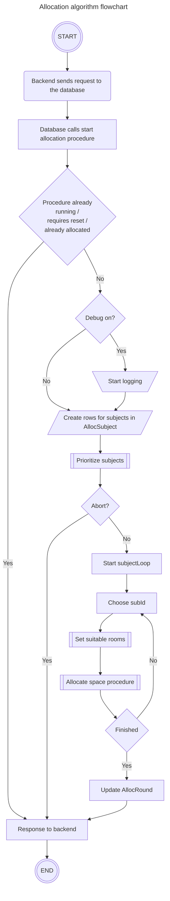
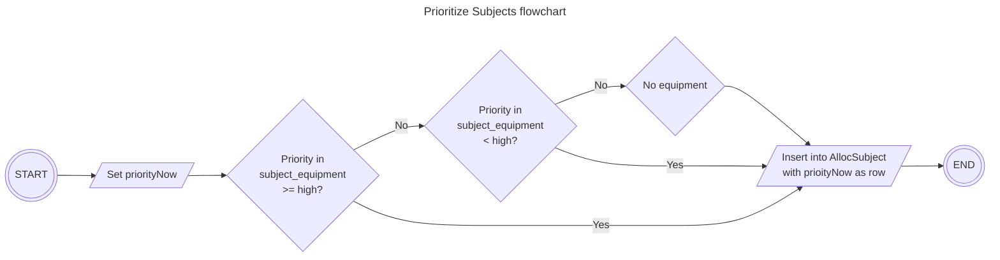
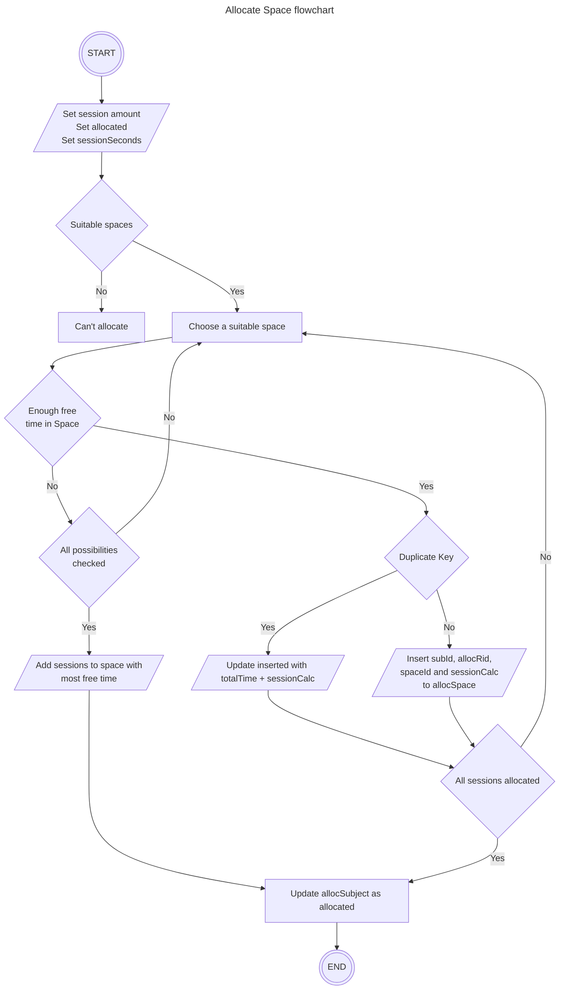

```mermaid
---
title: Allocation algorithm flowchart
---
    flowchart TD
        id1(((START))) --> A
        A(Backend sends request to the database) -->B[Database calls start allocation procedure]
        B --> C{Procedure already
        running /
        requires reset /
        already allocated}
        C -->|No| D{Debug on?}
        C -->|Yes| E[Response to backend]
        D -->|Yes| F[\Start logging/]
        D -->|No| G
        F --> G[/Create rows for subjects in AllocSubject/]
        G --> H[[Prioritize subjects]]
        H --> I{Abort?}
        I -->|Yes| E
        I -->|No| J[Start subjectLoop]
        J --> K[Choose subId]
        K --> L[[Set suitable rooms]]
        L --> M[[Allocate space procedure]]
        M --> N{Finished}
        N -->|No| K
        N -->|Yes| O[Update AllocRound]
        O --> E
        E --> P(((END)))

```

```

```


```mermaid
---
title: Prioritize Subjects flowchart
---
    flowchart LR
        id1(((START))) --> A
        A[/Set priorityNow/] --> B{Priority in
        subject_equipment
        >= high?}
        B -->|No| C{Priority in
        subject_equipment
        < high?}
        C -->|No| D{No equipment}
        D --> E[/Insert into AllocSubject
        with prioityNow as row/]
        B -->|Yes| E
        C -->|Yes| E
        E --> F(((END)))

```

```
sessionCalc = sessionSeconds * (sessions - i - allocated)
```


```mermaid
---
title: Allocate Space flowchart
---
    flowchart TD
        id1(((START))) --> A
        A[/Set session amount
        Set allocated
        Set sessionSeconds/] --> B{Suitable spaces}
        B -->|No| L[Can't allocate]
        B -->|Yes| C[Choose a suitable space]
        C --> D{Enough free
        time in Space}
        D -->|No| E{All possibilities
        checked}
        E -->|No| C
        E -->|Yes| F[/Add sessions to space with
        most free time/]
        F --> N[Update allocSubject as allocated]
        D -->|Yes| G{Duplicate Key}
        G -->|No| H[/Insert subId, allocRid,
        spaceId and sessionCalc
        to allocSpace/]
        G -->|Yes| I[/Update inserted with totalTime + sessionCalc/]
        I --> J{All sessions allocated}
        H --> J
        J -->|No| C
        J -->|Yes| N
        N --> O(((END)))
```
