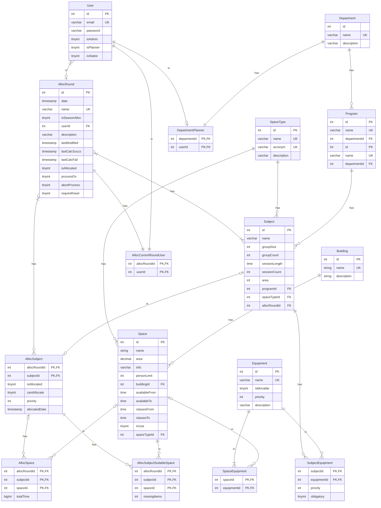

```mermaid

erDiagram
    Building ||--o{ Space: has
    Space |o--o{ AllocSpace : in
    Space ||--o{AllocSubjectSuitableSpace : in
    Space |o--o{ SpaceEquipment : in
    Equipment ||--|{SpaceEquipment : in
    Equipment ||--o{SubjectEquipment : is
    AllocSubject |o--o{ AllocSpace : has
    AllocSubject ||--o{ AllocSubjectSuitableSpace : has
    Subject |o--o| AllocSubject : in
    Subject ||--o{SubjectEquipment : has
    Program ||--o{ Subject : has
    SpaceType ||--o{ Subject : has
    SpaceType ||--o{ Space :has
    Department ||--o{ Program : has
    Department ||--|| DepartmentPlanner :has
    User ||--o| DepartmentPlanner :is
    User }|--o| AllocRound :in
    User ||--|| AllocCurrentRoundUser : is
    AllocRound ||--|| AllocCurrentRoundUser : has
    AllocRound }|--|{ Subject :has
    AllocRound }|--o{ AllocSubject :has

    User {
        int id PK
        varchar email UK
        varchar password
        tinyint isAdmin
        tinyint isPlanner
        tinyint isStatist
    }

    Department {
        int id
        varchar name UK
        varchar description
    }

    AllocCurrentRoundUser {
        int allocRoundId PK, FK
        int userId PK, FK
    }

    AllocRound {
        int id PK
        timestamp date
        varchar name UK
        tinyint isSeasonAlloc
        int userId FK
        varchar description
        timestamp lastModified
        timestamp lastCalcSuccs
        timestamp lastCalcFail
        tinyint isAllocated
        tinyint processOn
        tinyint abortProcess
        tinyint requireReset
    }

    DepartmentPlanner {
        int deparmentId PK, FK
        int userId PK,FK
    }

    Program {
        int id PK
        varchar name UK
        int departmentId FK
    }

    Space {
        int id PK
        string name
        decimal area
        varchar info
        int personLimit
        int buildingId FK
        time availableFrom
        time availableTo
        time classesFrom
        time classesTo
        tinyint inUse
        int spaceTypeId FK
    }

    SpaceType {
        int id PK
        varchar name UK
        varchar acronym UK
        varchar description
    }

    Building {
        int id PK
        string name UK
        string description
    }

    AllocSpace {
        int allocRoundId PK, FK
        int subjectId PK, FK
        int spaceId PK, FK
        bigInt totalTime
    }

    AllocSubjectSuitableSpace {
        int allocRoundId PK, FK
        int subjectId PK, FK
        int spaceId PK, FK
        int missingItems
    }

    SpaceEquipment {
        int spaceId PK, FK
        int equipmentId PK, FK
    }

    Equipment {
        int id PK
        varchar name UK
        tinyint isMovable
        int priority
        varchar description
    }

    AllocSubject {
        int allocRoundId PK, FK
        int subjectId PK, FK
        tinyint isAllocated
        tinyint cantAllocate
        int priority
        timestamp allocatedDate
    }

    Subject {
        int id PK
        varchar name
        int groupSize
        int groupCount
        time sessionLength
        int sessionCount
        int area
        int programId FK
        int spaceTypeId FK
        int allocRoundId FK
    }
    SubjectEquipment {
        int subjectId PK, FK
        int equipmentId PK, FK
        int priority
        tinyint obligatory
    }

    Program {
        int id PK
        varchar name UK
        int departmentId FK
    }


```
