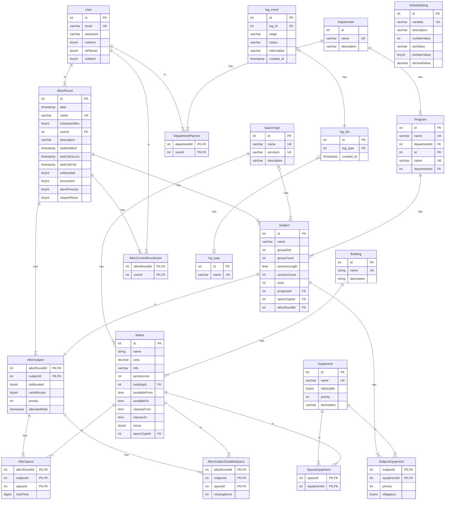

```mermaid

erDiagram
    Building ||--|{ Space: has
    Space ||--|{ AllocSpace : in
    Space ||--|{AllocSubjectSuitableSpace : in
    Space ||--|{ SpaceEquipment : in
    Equipment ||--|{SpaceEquipment : in
    Equipment ||--|{SubjectEquipment : is
    AllocSubject ||--|{ AllocSpace : has
    AllocSubject ||--|{ AllocSubjectSuitableSpace : has
    Subject ||--|| AllocSubject : in
    Subject ||--|{SubjectEquipment : has
    Program ||--|{ Subject : has
    SpaceType |o--|{ Subject : has
    SpaceType ||--|{ Space :has
    Department ||--|{ Program : has
    Department ||--|{ DepartmentPlanner :has
    User ||--|{ DepartmentPlanner :is
    User ||--|{ AllocRound :in
    User ||--|{ AllocCurrentRoundUser : is
    AllocRound ||--|{ AllocCurrentRoundUser : has
    AllocRound ||--|{ Subject :has
    AllocRound ||--|{ AllocSubject :has

    log_event }|--|| log_list : has
    log_list }|--o| log_type : has

    User {
        int id PK
        varchar email UK
        varchar password
        tinyint isAdmin
        tinyint isPlanner
        tinyint isStatist
    }

    Department {
        int id
        varchar name UK
        varchar description
    }

    AllocCurrentRoundUser {
        int allocRoundId PK, FK
        int userId PK, FK
    }

    AllocRound {
        int id PK
        timestamp date
        varchar name UK
        tinyint isSeasonAlloc
        int userId FK
        varchar description
        timestamp lastModified
        timestamp lastCalcSuccs
        timestamp lastCalcFail
        tinyint isAllocated
        tinyint processOn
        tinyint abortProcess
        tinyint requireReset
    }

    DepartmentPlanner {
        int deparmentId PK, FK
        int userId PK,FK
    }

    Program {
        int id PK
        varchar name UK
        int departmentId FK
    }

    Space {
        int id PK
        string name
        decimal area
        varchar info
        int personLimit
        int buildingId FK
        time availableFrom
        time availableTo
        time classesFrom
        time classesTo
        tinyint inUse
        int spaceTypeId FK
    }

    SpaceType {
        int id PK
        varchar name UK
        varchar acronym UK
        varchar description
    }

    Building {
        int id PK
        string name UK
        string description
    }

    AllocSpace {
        int allocRoundId PK, FK
        int subjectId PK, FK
        int spaceId PK, FK
        bigInt totalTime
    }

    AllocSubjectSuitableSpace {
        int allocRoundId PK, FK
        int subjectId PK, FK
        int spaceId PK, FK
        int missingItems
    }

    SpaceEquipment {
        int spaceId PK, FK
        int equipmentId PK, FK
    }

    Equipment {
        int id PK
        varchar name UK
        tinyint isMovable
        int priority
        varchar description
    }

    AllocSubject {
        int allocRoundId PK, FK
        int subjectId PK, FK
        tinyint isAllocated
        tinyint cantAllocate
        int priority
        timestamp allocatedDate
    }

    Subject {
        int id PK
        varchar name
        int groupSize
        int groupCount
        time sessionLength
        int sessionCount
        int area
        int programId FK
        int spaceTypeId FK
        int allocRoundId FK
    }
    SubjectEquipment {
        int subjectId PK, FK
        int equipmentId PK, FK
        int priority
        tinyint obligatory
    }

    Program {
        int id PK
        varchar name UK
        int departmentId FK
    }

    log_event {
        int id PK
        int log_id FK
        varchar stage
        varchar status
        varchar information
        timestamp created_at
    }

    log_list {
        int id PK
        int log_type FK
        timestamp created_at
    }

    log_type {
        int id PK
        varchar name UK
    }

    GlobalSetting {
        int id PK
        varchar variable UK
        varchar description
        int numberValue
        varchar textValue
        tinyint booleanValue
        decimal decimalValue
    }


```
