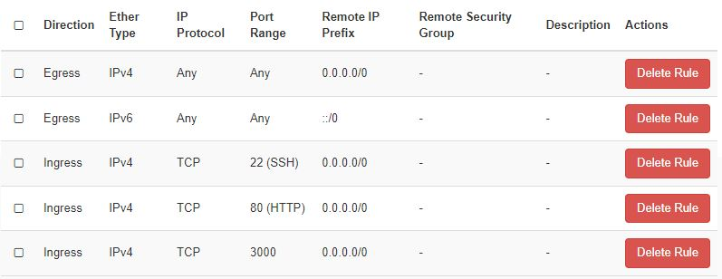

# CSC cloud Ubuntu VM Siba deployment with Docker

Updated: 4.4.2024 (April 4 2024)

This documentation explains how to deploy the Siba project to the CSC cloud cPouta Ubuntu virtual machine using Docker. It is assumed that the user has the VM running and can connect to it with SSH. Some Linux understanding can also be helpful.

- VM OS: Ubuntu 22.04 LTS (64-bit)

Some parts of this documentation are based on this: https://github.com/haagahelia/ohke-teknologiat/blob/master/01_docker/fullstack_dockerized_task/Manual_Installation_commands.md

## Security Groups and firewall

CSC cloud Pouta security groups used:



- Port 22 is for SSH
- Port 80 is for the Nginx frontend
- Port 3000 is for the backend API

Pouta Security Groups are used to setup firewall rules in this deployment. Another option to manage firewall is to use ufw inside the Ubuntu VM.

Security Groups can be found by going to Project -> Network -> Security Groups

**NOTE**: Do not open unnecessary ports because it is a security risk! Only open ports that are needed.

More detailed information: https://docs.csc.fi/cloud/pouta/security/

## Update the system

```sh
sudo apt update && sudo apt upgrade -y
```

## Install Docker if not installed

Instructions used: https://docs.docker.com/engine/install/ubuntu/

Remove conflicting Docker packages
```sh
for pkg in docker.io docker-doc docker-compose docker-compose-v2 podman-docker containerd runc; do sudo apt remove $pkg; done
```

Set up Docker's apt repository
```sh
# Add Docker's official GPG key:
sudo apt update
sudo apt install ca-certificates curl
sudo install -m 0755 -d /etc/apt/keyrings
sudo curl -fsSL https://download.docker.com/linux/ubuntu/gpg -o /etc/apt/keyrings/docker.asc
sudo chmod a+r /etc/apt/keyrings/docker.asc

# Add the repository to Apt sources:
echo \
  "deb [arch=$(dpkg --print-architecture) signed-by=/etc/apt/keyrings/docker.asc] https://download.docker.com/linux/ubuntu \
  $(. /etc/os-release && echo "$VERSION_CODENAME") stable" | \
  sudo tee /etc/apt/sources.list.d/docker.list > /dev/null
sudo apt update
```

Install the latest Docker packages including Docker Compose:
```sh
sudo apt install docker-ce docker-ce-cli containerd.io docker-buildx-plugin docker-compose-plugin
```

Check the Docker version
```sh
sudo docker version
```

Check the Docker Compose version
```sh
sudo docker compose version
```

Check if the Docker daemon is running
```sh
sudo systemctl status docker
ps -ef | grep docker
```

Enable if not enabled
```sh
sudo systemctl enable docker
```

## Get the source code

Check if git is already installed
```sh
git --version
```

Install it if not installed
```sh
sudo apt update
sudo apt install git
```

This is a very simple way to install git. More detailed info here: https://www.digitalocean.com/community/tutorials/how-to-install-git-on-ubuntu-22-04

Create the directory for the source code
```sh
cd ~
mkdir siba
```

Clone the frontend and backend git repositories
```sh
cd siba
git clone https://github.com/haagahelia/Siba_be.git
git clone https://github.com/haagahelia/siba-fe.git
```

Pull the latests changes if needed
```sh
cd ~/siba/Siba_be
git pull
cd ~/siba/siba-fe
git pull
```

## Deploy the database and backend with Docker

In order to prevent unnecessary environment variables from ending up in the containers, we want to create multiple environment variable files and load only what we need.

Create `.env.db`, `.env.db.root` and `.env.be` files for environment variables and set permissions
```sh
cd ~/siba/Siba_be
touch .env.db
touch .env.db.root
touch .env.be
sudo chmod 644 .env.db
sudo chmod 644 .env.db.root
sudo chmod 644 .env.be
```
The docker compose script that is used expects the file names above.

Add the following environment variables to the `.env.db` file
```sh
MARIADB_DATABASE=casedb
MARIADB_USER=<YOUR_DATABASE_USER>
MARIADB_PASSWORD=<YOUR_DATABASE_USER_PASSWORD>
```
Replace the values with your actual values. This is used both in the database and backend containers.

Add the following environment variable to the `.env.db.root` file
```sh
MARIADB_ROOT_PASSWORD=<YOUR_ROOT_PASSWORD>
```
Replace the value with your desired database root user password. This is used only in the database container.

Add the following environment variables to the `.env.be` file
```sh
BE_API_URL_PREFIX=/api
BE_SERVER_PORT=3000
DB_DRIVER_MODULE=mysql
DB_PORT=3306
DB_MULTIPLE_STATEMENTS=true
DB_CONNECTION_POOL_MIN=1
DB_CONNECTION_POOL_MAX=7
SECRET_TOKEN=<YOUR_SECRET_TOKEN>
TOKEN_EXPIRATION_SECONDS=3600
```
Replace the values with your actual values. This is used only in the backend container.

Start the database and backend containers
```sh
sudo docker compose -f ~/siba/Siba_be/docker-compose-dbbe-deploy.yaml up -d
```
With -d the container will be run in the background. This way you can keep using the same terminal to run other commands.

Check if the containers started
```sh
sudo docker ps
```

The backend API should now be accessible at `http://<VMIPADDRESS>:3000/api` where `<VMIPADDRESS>` is the public IP address of the virtual machine. The backend listens in port 3000 and that port is opened with firewall rules. The database is not exposed outside the VM, but can be exposed by opening port 3306.

To stop and remove the containers, run
```sh
sudo docker compose -f ~/siba/Siba_be/docker-compose-dbbe-deploy.yaml down
```

If you need to rebuild the backend image before starting containers, pass `--build` to the command
```sh
sudo docker compose -f ~/siba/Siba_be/docker-compose-dbbe-deploy.yaml up -d --build
```

## Deploy the frontend with Docker

Some parts are based on this: https://github.com/haagahelia/siba-fe?tab=readme-ov-file#beginning

Create the frontend .env file for environment variables and set permissions
```sh
cd ~/siba/siba-fe
touch .env
sudo chmod 644 .env
```

Add the following environment variables to the .env file
```sh
VITE_BE_SERVER_BASE_URL=http://<VMIPADDRESS>:3000/api
PORT=80
```
Replace `<VMIPADDRESS>` with the public IP address of the virtual machine. This is the backend API address the frontend will use to make requests.

Run the frontend Docker container that uses Nginx web server to serve the React application
```sh
sudo docker compose -f ~/siba/siba-fe/docker-compose-fe-nginx.yaml up -d
```
With -d the container will be run in the background. This way you can keep using the same terminal to run other commands.

Check if the container started
```sh
sudo docker ps
```

The frontend should now be available at `http://<VMIPADDRESS>` where `<VMIPADDRESS>` is the public IP address of the virtual machine. The frontend is served through port 80.

To stop and remove the container, run
```sh
sudo docker compose -f ~/siba/siba-fe/docker-compose-fe-nginx.yaml down
```

If you need to rebuild the frontend image before starting container, pass `--build` to the command
```sh
sudo docker compose -f ~/siba/siba-fe/docker-compose-fe-nginx.yaml up -d --build
```

## Removing Docker volumes

Sometimes removing the volume the Docker compose script creates is needed.

View volumes
```sh
sudo docker volume ls
```

Example of removing the volume
```sh
sudo docker volume rm siba_be_mariadb_data
```
Replace the volume name with the actual volume. WARNING: This will reset the data in the database!

## Other useful commands

Go inside a container to view the file system, environment variables etc.
```sh
sudo docker exec -it <container id or name> sh
```

View container logs. Useful for debugging.
```sh
sudo docker logs <container id or name>
```
